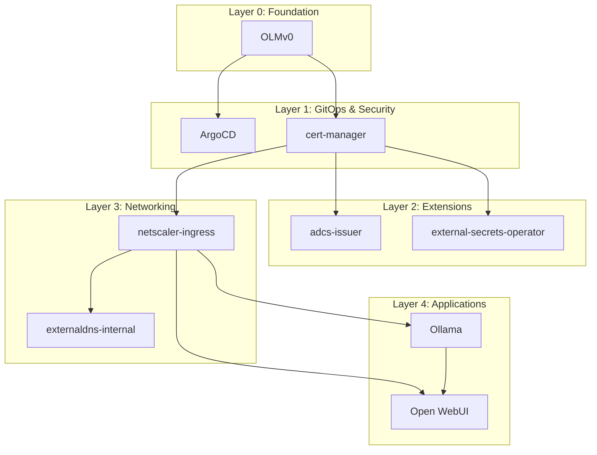

# <CUSTOMER_SHORT_UPPER> NKP GitOps Platform Deployment Guide

## Table of Contents
- [Automated Deployment](#automated-deployment-recommended)
- [Manual Deployment](#manual-deployment-step-by-step)
- [Deployment Layers](#deployment-layers)
- [Verification Commands](#verification-commands)
- [Troubleshooting](#troubleshooting)
- [Rollback Procedures](#rollback-procedures)

## Choose Your Deployment Method

### Automated Deployment (Recommended)
**Use when:** You want quick, reliable deployment with automatic dependency handling.

```bash
./deploy-cluster.sh platform-test01
```

**Advantages:**
- Automatically handles dependencies
- Waits for CRDs and pods to be ready
- Color-coded progress output
- Built-in error handling
- Dry-run mode available

### Manual Deployment
**Use when:** You need fine-grained control, are debugging issues, or learning the platform.

Follow the [Manual Deployment](#manual-deployment-step-by-step) section below.

**Advantages:**
- Full control over each step
- Easier to debug specific components
- Can skip unwanted components
- Better understanding of dependencies

---

## Automated Deployment (Recommended)

Deploy the complete platform stack automatically:

```bash
# Deploy to platform-test01
./deploy-cluster.sh platform-test01

# Deploy to production
./deploy-cluster.sh platform-prod01

# Dry run (preview what will be deployed)
DRY_RUN=true ./deploy-cluster.sh platform-test01

# Re-deploy using existing manifests (skip build step)
SKIP_BUILD=true ./deploy-cluster.sh platform-test01

# Show help and options
./deploy-cluster.sh --help
```

### What the Script Does

1. **Validates prerequisites** - Checks tools and cluster connectivity
2. **Layer 0**: Installs OLMv0
3. **Layer 1**: Deploys cert-manager and ArgoCD
4. **Layer 2**: Deploys ADCS issuer and External Secrets Operator
5. **Layer 3**: Deploys Netscaler ingress and External DNS
6. **Layer 4**: Deploys Ollama and Open WebUI
7. **Waits between layers** - Ensures CRDs and pods are ready

---

## Manual Deployment (Step-by-Step)

Complete manual deployment process with all commands.

## Deployment Layers

The script deploys applications in dependency order across 5 layers:

### Layer 0: Foundation
- **OLMv0** - Operator Lifecycle Manager
  - Required for: ArgoCD
  - Namespaces: `olm`, `operators`

### Layer 1: GitOps & Security
- **cert-manager** - Certificate management and automation
  - Namespace: `platform-cert-manager`
  - CRDs: certificates, issuers, clusterissuers
  - Wait time: CRDs + webhook ready (~30s)
  
- **ArgoCD** - GitOps continuous delivery (WIP)
  - Namespace: `argocd`
  - Deployment: Via ArgoCD Operator (not Helm)
  - Status: Work-in-progress
  - Enables: Automated deployment from Git

### Layer 2: Platform Extensions
- **adcs-issuer** - Microsoft Active Directory Certificate Services
  - Namespace: `platform-adcs-issuer`
  - Depends on: cert-manager CRDs
  - Purpose: Enterprise certificate issuance

- **external-secrets-operator** - External secrets synchronization
  - Namespace: `platform-eso`
  - Depends on: cert-manager (optional, for webhook TLS)
  - Purpose: Sync secrets from external secret management systems (Vault, AWS Secrets Manager, etc.)

### Layer 3: Networking
- **netscaler-ingress** - Citrix NetScaler Ingress Controller
  - Namespace: `platform-netscaler-ingress`
  - Depends on: cert-manager (for TLS)
  - Purpose: Load balancing and ingress
  
- **externaldns-internal** - Automatic DNS record management
  - Namespace: `platform-externaldns-internal`
  - Depends on: Ingress controller
  - Purpose: Sync ingress to internal DNS

### Layer 4: Application Services
- **Ollama** - Local LLM inference engine
  - Namespace: `ollama`
  - Purpose: Run language models locally
  
- **Open WebUI** - Web interface for LLM interaction
  - Namespace: `open-webui`
  - Depends on: Ollama API
  - Purpose: ChatGPT-like UI for local models

### Prerequisites Check

Before starting, ensure you have the necessary tools and access:

```bash
# Set your cluster name
export CLUSTER_NAME="platform-test01"

# Navigate to repository root
cd /path/to/<GITHUB_REPO>

# Verify required tools are installed
command -v kubectl || echo "kubectl not found - run: ./setup/required-tools.sh"
command -v helm || echo "helm not found - run: ./setup/required-tools.sh"
command -v operator-sdk || echo "operator-sdk not found - see bootstrap/1-OperatorFramwork_prep.md"

# Verify cluster connectivity
kubectl cluster-info
kubectl get nodes

# Verify cluster configuration exists
ls -l clusters/${CLUSTER_NAME}.yaml
```

### LAYER 0: Foundation

#### Install OLMv0 (Operator Lifecycle Manager)

```bash
# Install OLM - Required for ArgoCD operator
operator-sdk olm install --version "0.38.0"

# Wait for OLM to be ready (may take 30-60 seconds)
kubectl wait --for=condition=Ready pod -n olm -l app=olm-operator --timeout=300s
kubectl wait --for=condition=Ready pod -n olm -l app=catalog-operator --timeout=300s

# Verify OLM installation
kubectl get pods -n olm
kubectl get crd | grep operators.coreos.com
```

**Expected output:**
- `olm-operator` and `catalog-operator` pods running
- Multiple operator CRDs created

---

### LAYER 1: GitOps & Security

#### Deploy cert-manager (Certificate Management)

```bash
# Navigate to cert-manager template
cd templates/cert-manager

# Build manifests for your cluster
./build.sh ${CLUSTER_NAME}

# Review generated manifests (optional)
ls -lR ../../deployments/${CLUSTER_NAME}/cert-manager/

# Deploy cert-manager
kubectl apply -f ../../deployments/${CLUSTER_NAME}/cert-manager/ --recursive

# Wait for cert-manager to be ready (critical - wait before proceeding!)
kubectl wait --for=condition=Ready pod \
  -n platform-cert-manager \
  -l app.kubernetes.io/name=cert-manager \
  --timeout=300s

# Verify cert-manager CRDs are established
kubectl get crd | grep cert-manager.io

# Check cert-manager webhook is ready
kubectl get pods -n platform-cert-manager
kubectl logs -n platform-cert-manager -l app=webhook --tail=20

# Give webhook extra time to initialize
sleep 10
```

**Expected output:**
- cert-manager, webhook, and cainjector pods running
- CRDs: certificates, certificaterequests, issuers, clusterissuers

**Verification:**
```bash
# Test cert-manager is working
kubectl get clusterissuers -A
kubectl describe pod -n platform-cert-manager -l app.kubernetes.io/name=cert-manager
```

#### Deploy ArgoCD (GitOps - Optional)

**Note:** ArgoCD deployment uses the **operator pattern** (not Helm) and is currently **work-in-progress**. Skip this step unless you're actively developing the ArgoCD deployment.

**Deployment Method:** ArgoCD is deployed via the ArgoCD Operator installed through OLM. The deployment uses a custom resource (CR) located in `templates/argocd/operator/argocd-deploy.yaml`.

```bash
# Prerequisites: OLM must be installed (Layer 0)
# ArgoCD Operator should be installed via OLM subscription

# Navigate to ArgoCD template
cd ../argocd

# Deploy ArgoCD CR (operator-based deployment)
kubectl apply -f operator/argocd-deploy.yaml

# Wait for ArgoCD to be ready
kubectl wait --for=condition=Ready pod \
  -n argocd \
  -l app.kubernetes.io/name=argocd-server \
  --timeout=300s

# Get ArgoCD initial admin password
echo "ArgoCD admin password:"
kubectl -n argocd get secret argocd-cluster \
  -o jsonpath="{.data.admin\.password}" | base64 -d
echo ""

# Get ArgoCD server URL
kubectl get ingress -n argocd
```

**Expected output:**
- ArgoCD server, repo-server, and application-controller pods running
- ArgoCD ingress configured (argocd.k8s.<CUSTOMER_LAB_DOMAIN>)
- Initial admin password displayed

**Note:** The build.sh script in this template is not used - ArgoCD deployment is handled by the operator CR.

---

### LAYER 2: Platform Extensions

#### Deploy ADCS Issuer (Microsoft AD Certificate Services)

**Critical:** cert-manager must be fully ready before deploying ADCS issuer!

```bash
# Navigate to ADCS issuer template
cd ../adcs-issuer

# Build manifests
./build.sh ${CLUSTER_NAME}

# Deploy ADCS issuer
kubectl apply -f ../../deployments/${CLUSTER_NAME}/adcs-issuer/ --recursive

# Wait for ADCS issuer to be ready
kubectl wait --for=condition=Ready pod \
  -n platform-adcs-issuer \
  -l app.kubernetes.io/name=adcs-issuer \
  --timeout=300s

# Verify ADCS issuer CRDs
kubectl get crd | grep adcs

# Check ADCS issuer logs
kubectl logs -n platform-adcs-issuer -l app.kubernetes.io/name=adcs-issuer --tail=20
```

**Expected output:**
- ADCS issuer pod running
- CRDs: adcsissuers, clusteradcsissuers

**Verification:**
```bash
# Check if ADCS issuer can talk to cert-manager
kubectl get deployment -n platform-adcs-issuer -o yaml | grep certManagerNamespace
# Should show: certManagerNamespace: platform-cert-manager
```

#### Deploy External Secrets Operator

**Optional:** Only deploy if you need to synchronize secrets from external sources (Vault, AWS Secrets Manager, Azure Key Vault, etc.)

```bash
# Navigate to External Secrets Operator template
cd ../external-secrets-operator

# Build manifests
./build.sh ${CLUSTER_NAME}

# Deploy External Secrets Operator
kubectl apply -f ../../deployments/${CLUSTER_NAME}/external-secrets-operator/ --recursive

# Wait for ESO to be ready
kubectl wait --for=condition=Ready pod \
  -n platform-eso \
  -l app.kubernetes.io/name=external-secrets \
  --timeout=300s

# Verify ESO CRDs
kubectl get crd | grep external-secrets.io

# Check ESO logs
kubectl logs -n platform-eso -l app.kubernetes.io/name=external-secrets --tail=20
```

**Expected output:**
- External Secrets Operator pods running (controller, webhook, cert-controller)
- CRDs: externalsecrets, secretstores, clustersecretstores

**Verification:**
```bash
# List ESO resources
kubectl get externalsecrets -A
kubectl get secretstores -A
kubectl get clustersecretstores -A

# Check webhook is ready
kubectl get pods -n platform-eso | grep webhook
```

---

### LAYER 3: Networking

#### Deploy Netscaler Ingress Controller

```bash
# Navigate to Netscaler template
cd ../netscaler-ingress

# Build manifests
./build.sh ${CLUSTER_NAME}

# Review Netscaler configuration (important!)
cat ../../deployments/${CLUSTER_NAME}/netscaler-ingress/install/install.yaml | grep -A 10 "NS_IP"

# Deploy Netscaler ingress controller
kubectl apply -f ../../deployments/${CLUSTER_NAME}/netscaler-ingress/ --recursive

# Wait for CIC to be ready
kubectl wait --for=condition=Ready pod \
  -n platform-netscaler-ingress \
  -l app.kubernetes.io/name=citrix-ingress-controller \
  --timeout=300s

# Check CIC logs for Netscaler connectivity
kubectl logs -n platform-netscaler-ingress \
  -l app.kubernetes.io/name=citrix-ingress-controller \
  --tail=50
```

**Expected output:**
- Citrix Ingress Controller pod running
- Logs showing successful connection to Netscaler IP

**Verification:**
```bash
# Verify CIC can reach Netscaler
kubectl get pods -n platform-netscaler-ingress
kubectl describe pod -n platform-netscaler-ingress -l app.kubernetes.io/name=citrix-ingress-controller

# Check for error messages
kubectl logs -n platform-netscaler-ingress -l app.kubernetes.io/name=citrix-ingress-controller | grep -i error
```

#### Deploy External DNS (Internal)

```bash
# Navigate to External DNS template
cd ../externaldns-internal

# Build manifests
./build.sh ${CLUSTER_NAME}

# Deploy External DNS
kubectl apply -f ../../deployments/${CLUSTER_NAME}/externaldns-internal/ --recursive

# Wait for External DNS to be ready
kubectl wait --for=condition=Ready pod \
  -n platform-externaldns-internal \
  -l app.kubernetes.io/name=external-dns \
  --timeout=300s

# Check External DNS logs (should show DNS provider initialization)
kubectl logs -n platform-externaldns-internal \
  -l app.kubernetes.io/name=external-dns \
  --tail=50
```

**Expected output:**
- External DNS pod running
- Logs showing DNS provider connection and ingress resource discovery

**Verification:**
```bash
# External DNS should start watching for ingress resources
kubectl logs -n platform-externaldns-internal \
  -l app.kubernetes.io/name=external-dns \
  -f
# Press Ctrl+C after a few seconds
```

---

### LAYER 4: Application Services

#### Deploy Ollama (LLM Backend)

**Optional:** Only deploy if you need local LLM inference.

```bash
# Navigate to Ollama template
cd ../ollama

# Build manifests
./build.sh ${CLUSTER_NAME}

# Review Ollama configuration
cat ../../deployments/${CLUSTER_NAME}/ollama/install/install.yaml | grep -A 5 "resources:"

# Deploy Ollama
kubectl apply -f ../../deployments/${CLUSTER_NAME}/ollama/ --recursive

# Wait for Ollama to be ready (may take a few minutes for large images)
kubectl wait --for=condition=Ready pod \
  -n ollama \
  -l app.kubernetes.io/name=ollama \
  --timeout=600s

# Check Ollama is running
kubectl logs -n ollama -l app.kubernetes.io/name=ollama --tail=20

# Get Ollama service endpoint
kubectl get svc -n ollama
```

**Expected output:**
- Ollama pod running
- Service exposing port 11434

**Verification:**
```bash
# Test Ollama API (from within cluster)
kubectl run -it --rm debug --image=curlimages/curl --restart=Never -- \
  curl http://ollama.ollama.svc.cluster.local:11434/api/tags

# Should return JSON with models list (may be empty initially)
```

#### Deploy Open WebUI (LLM Frontend)

**Prerequisite:** Ollama must be deployed first.

```bash
# Navigate to Open WebUI template
cd ../open-webui

# Build manifests
./build.sh ${CLUSTER_NAME}

# Review Open WebUI configuration
cat ../../deployments/${CLUSTER_NAME}/open-webui/install/install.yaml | grep -A 10 "OLLAMA"

# Deploy Open WebUI
kubectl apply -f ../../deployments/${CLUSTER_NAME}/open-webui/ --recursive

# Wait for Open WebUI to be ready
kubectl wait --for=condition=Ready pod \
  -n open-webui \
  -l app.kubernetes.io/name=open-webui \
  --timeout=300s

# Get Open WebUI access information
echo "Open WebUI ingress:"
kubectl get ingress -n open-webui

echo -e "\nOpen WebUI service:"
kubectl get svc -n open-webui

# Check Open WebUI logs
kubectl logs -n open-webui -l app.kubernetes.io/name=open-webui --tail=20
```

**Expected output:**
- Open WebUI pod running
- Ingress created with hostname
- Service exposing port 80

**Verification:**
```bash
# Check if Open WebUI can reach Ollama
kubectl exec -n open-webui -it $(kubectl get pod -n open-webui -l app.kubernetes.io/name=open-webui -o jsonpath='{.items[0].metadata.name}') -- \
  curl -s http://ollama.ollama.svc.cluster.local:11434/api/tags

# Should return Ollama model list
```

---

### Post-Deployment Verification

Run these commands to verify the entire platform is healthy:

```bash
# Check all platform pods
kubectl get pods -A | grep -E 'cert-manager|argocd|adcs|eso|netscaler|external-dns|ollama|open-webui'

# Check all services
kubectl get svc -A | grep -E 'cert-manager|argocd|adcs|eso|netscaler|external-dns|ollama|open-webui'

# Check all ingresses
kubectl get ingress -A

# Check External Secrets (if deployed)
kubectl get externalsecrets -A
kubectl get secretstores -A

# Summary of deployed resources
echo "=== DEPLOYMENT SUMMARY ==="
echo "cert-manager: $(kubectl get pods -n platform-cert-manager --no-headers | wc -l) pods"
echo "ADCS Issuer: $(kubectl get pods -n platform-adcs-issuer --no-headers | wc -l) pods"
echo "External Secrets: $(kubectl get pods -n platform-eso --no-headers 2>/dev/null | wc -l) pods"
echo "Netscaler: $(kubectl get pods -n platform-netscaler-ingress --no-headers | wc -l) pods"
echo "External DNS: $(kubectl get pods -n platform-externaldns-internal --no-headers | wc -l) pods"
echo "Ollama: $(kubectl get pods -n ollama --no-headers 2>/dev/null | wc -l) pods"
echo "Open WebUI: $(kubectl get pods -n open-webui --no-headers 2>/dev/null | wc -l) pods"
```

---

## Common Manual Deployment Patterns

### Deploying a Single Application

```bash
# General pattern for any application
export CLUSTER_NAME="platform-test01"
export APP_NAME="cert-manager"  # Change to your app

cd templates/${APP_NAME}
./build.sh ${CLUSTER_NAME}
kubectl apply -f ../../deployments/${CLUSTER_NAME}/${APP_NAME}/ --recursive

# Wait and verify
kubectl get pods -n platform-${APP_NAME}
```

### Rebuilding Manifests Only

```bash
# Rebuild all applications without deploying
export CLUSTER_NAME="platform-test01"

for app in cert-manager adcs-issuer external-secrets-operator netscaler-ingress externaldns-internal ollama open-webui; do
  echo "Building $app..."
  cd templates/$app
  ./build.sh ${CLUSTER_NAME}
  cd ../..
done

# Review all generated manifests
find deployments/${CLUSTER_NAME}/ -name "*.yaml" -type f
```

### Deploying Only Specific Layers

```bash
# Deploy only networking layer (Layer 3)
export CLUSTER_NAME="platform-test01"

# Netscaler
cd templates/netscaler-ingress
./build.sh ${CLUSTER_NAME}
kubectl apply -f ../../deployments/${CLUSTER_NAME}/netscaler-ingress/ --recursive

# External DNS
cd ../externaldns-internal
./build.sh ${CLUSTER_NAME}
kubectl apply -f ../../deployments/${CLUSTER_NAME}/externaldns-internal/ --recursive
```

## Verification Commands

### Check all platform pods
```bash
kubectl get pods -A | grep -E 'cert-manager|argocd|adcs|netscaler|external-dns|ollama|open-webui'
```

### Check certificate management
```bash
# List all certificates
kubectl get certificates -A

# Check cert-manager logs
kubectl logs -n platform-cert-manager -l app=cert-manager
```

### Check ingress resources
```bash
# List all ingresses
kubectl get ingress -A

# Check Netscaler CIC logs
kubectl logs -n platform-netscaler-ingress -l app.kubernetes.io/name=citrix-ingress-controller
```

### Check DNS synchronization
```bash
# External DNS logs (should show DNS record updates)
kubectl logs -n platform-externaldns-internal -l app.kubernetes.io/name=external-dns -f
```

### Check Ollama and Open WebUI
```bash
# Check Ollama is running
kubectl get pods -n ollama
kubectl logs -n ollama -l app.kubernetes.io/name=ollama

# Check Open WebUI
kubectl get pods -n open-webui
kubectl get svc -n open-webui
kubectl get ingress -n open-webui
```

## Troubleshooting

### cert-manager webhook not ready
```bash
# Check webhook pod
kubectl get pods -n platform-cert-manager | grep webhook

# Check webhook logs
kubectl logs -n platform-cert-manager -l app=webhook

# Restart webhook if needed
kubectl rollout restart deployment cert-manager-webhook -n platform-cert-manager
```

### ADCS Issuer not working
```bash
# Verify cert-manager namespace is correct
kubectl get deployment -n platform-adcs-issuer adcs-issuer -o yaml | grep certManagerNamespace

# Check ADCS issuer logs
kubectl logs -n platform-adcs-issuer -l app.kubernetes.io/name=adcs-issuer
```

### Netscaler CIC not connecting
```bash
# Check if Netscaler IP is reachable
kubectl exec -n platform-netscaler-ingress <cic-pod-name> -- ping <nsIP>

# Check CIC configuration
kubectl get configmap -n platform-netscaler-ingress

# Check CIC logs for connection errors
kubectl logs -n platform-netscaler-ingress -l app.kubernetes.io/name=citrix-ingress-controller
```

### External DNS not creating records
```bash
# Check if external-dns has permissions
kubectl get clusterrole external-dns
kubectl get clusterrolebinding external-dns

# Check for events
kubectl get events -n platform-externaldns-internal

# Verify DNS provider configuration
kubectl get deployment -n platform-externaldns-internal external-dns -o yaml
```

### Open WebUI can't connect to Ollama
```bash
# Verify Ollama service endpoint
kubectl get svc -n ollama

# Check Open WebUI environment variables
kubectl get deployment -n open-webui -o yaml | grep -A 10 env

# Test Ollama from Open WebUI pod
kubectl exec -n open-webui <pod-name> -- curl http://ollama.ollama.svc.cluster.local:11434/api/tags
```

## Rollback Procedures

### Rollback a specific application
```bash
# Example: Rollback Open WebUI deployment
kubectl rollout undo deployment open-webui -n open-webui

# Rollback to specific revision
kubectl rollout undo deployment open-webui -n open-webui --to-revision=2
```

### Complete platform removal
```bash
# Remove Layer 4
kubectl delete -f deployments/platform-test01/open-webui/ --recursive
kubectl delete -f deployments/platform-test01/ollama/ --recursive

# Remove Layer 3
kubectl delete -f deployments/platform-test01/externaldns-internal/ --recursive
kubectl delete -f deployments/platform-test01/netscaler-ingress/ --recursive

# Remove Layer 2
kubectl delete -f deployments/platform-test01/external-secrets-operator/ --recursive
kubectl delete -f deployments/platform-test01/adcs-issuer/ --recursive

# Remove Layer 1
kubectl delete -f deployments/platform-test01/cert-manager/ --recursive
kubectl delete -f deployments/platform-test01/argocd/ --recursive

# Remove Layer 0
operator-sdk olm uninstall
```

## Environment Variables

The deployment script supports these environment variables:

| Variable | Default | Description |
|----------|---------|-------------|
| `SKIP_BUILD` | `false` | Skip manifest build, use existing files |
| `DRY_RUN` | `false` | Show what would be deployed without applying |

## Architecture Diagram



## Additional Resources

- [Cluster Workflow Documentation](CLUSTER_WORKFLOW.md)
- [Main README](README.md)
- [Bootstrap Procedures](bootstrap/)
- [cert-manager Documentation](https://cert-manager.io/docs/)
- [ArgoCD Documentation](https://argo-cd.readthedocs.io/)
- [Ollama Documentation](https://github.com/ollama/ollama)
- [Open WebUI Documentation](https://github.com/open-webui/open-webui)
